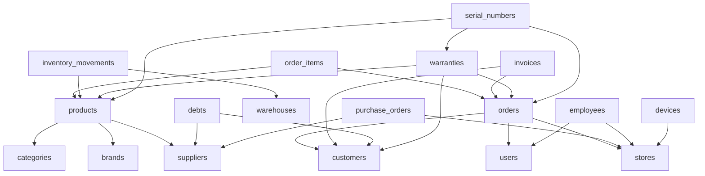

# Cloudflare D1 Database Schema - SmartPOS Production
## 100% Cloudflare Workers + D1 Database

**Database Name**: `namhbcf-uk`
**Database ID**: `55344bf5-d142-4c0d-9e53-0ace4c41870c`
**Total Tables**: 41 production tables (excluding test_table)
**Database Size**: 0.57 MB
**Last Updated**: 2025-10-01
**Environment**: Production

---

## 📊 Table Statistics

| Category | Tables | Description |
|----------|--------|-------------|
| **Core Business** | 8 | products, categories, customers, orders, order_items |
| **Inventory** | 4 | inventory_movements, warehouses, product_variants, stock_alerts |
| **Financial** | 6 | payments, invoices, debts, payment_methods, promotions |
| **Users & Auth** | 5 | users, roles, user_roles, auth_sessions, login_attempts |
| **Extended** | 11 | suppliers, brands, employees, devices, warranties, serial_numbers, purchase_orders, tasks |
| **System** | 7 | settings, file_uploads, schema_migrations, d1_migrations, pos_sessions, pos_daily_closings, parked_carts |

**Total**: 41 production tables

**Note**: `sales` and `sale_items` tables were removed in Migration 103 (2025-10-01). All sales transactions now use the `orders` table instead.

---

## 🔑 Core Business Tables

### 1. Products Table
**Purpose**: Central product catalog with pricing, stock, and categorization

```sql
CREATE TABLE products (
  id TEXT PRIMARY KEY,
  name TEXT,
  sku TEXT,
  barcode TEXT,
  description TEXT,

  -- Pricing (stored in cents INTEGER for precision)
  price_cents INTEGER,
  cost_price_cents INTEGER,

  -- Stock Management
  stock INTEGER,
  min_stock INTEGER,
  max_stock INTEGER,
  unit TEXT,
  weight_grams INTEGER,
  dimensions TEXT,

  -- Relationships
  category_id TEXT,
  brand_id TEXT,
  supplier_id TEXT,
  store_id TEXT,

  -- Media
  image_url TEXT,
  images TEXT,

  -- Cache fields (denormalized for performance)
  category_name TEXT,
  brand_name TEXT,

  -- Status
  is_active INTEGER,
  is_serialized INTEGER,

  -- Multi-tenancy
  tenant_id TEXT DEFAULT 'default',

  -- Timestamps
  created_at TEXT,
  updated_at TEXT
);
```

**Indexes**:
- `idx_products_tenant` on (tenant_id)
- `idx_products_sku` on (sku)
- `idx_products_barcode` on (barcode)
- `idx_products_category` on (category_id)
- `idx_products_active` on (is_active)

**Key Features**:
- ✅ Prices stored in cents (INTEGER) for precision
- ✅ Denormalized `category_name`, `brand_name` for fast queries
- ✅ Support for serialized products (warranty tracking)
- ✅ Multi-tenant support

---

### 2. Categories Table
**Purpose**: Product categorization with hierarchical support

```sql
CREATE TABLE categories (
  id TEXT PRIMARY KEY,
  name TEXT,
  description TEXT,
  parent_id TEXT,
  image_url TEXT,
  sort_order INTEGER,
  is_active INTEGER,
  tenant_id TEXT DEFAULT 'default',
  created_at TEXT,
  updated_at TEXT
);
```

**Key Features**:
- ✅ Hierarchical categories (parent_id)
- ✅ Custom sort order
- ✅ Image support

---

### 3. Customers Table
**Purpose**: Customer database with loyalty points and purchase history

```sql
CREATE TABLE customers (
  id TEXT PRIMARY KEY,
  name TEXT,
  email TEXT,
  phone TEXT,
  address TEXT,
  date_of_birth TEXT,
  gender TEXT,

  -- Customer Classification
  customer_type TEXT,

  -- Loyalty Program
  loyalty_points INTEGER,
  total_spent_cents INTEGER,
  visit_count INTEGER,
  last_visit TEXT,

  -- Status
  is_active INTEGER,
  tenant_id TEXT DEFAULT 'default',

  -- Timestamps
  created_at TEXT,
  updated_at TEXT
);
```

**Indexes**:
- `idx_customers_tenant` on (tenant_id)
- `idx_customers_email` on (email)
- `idx_customers_phone` on (phone)
- `idx_customers_type` on (customer_type)

**Key Features**:
- ✅ Built-in loyalty points system
- ✅ Total spent tracking (in cents)
- ✅ Visit count and last visit tracking

---

### 4. Orders Table
**Purpose**: Customer orders/transactions with payment tracking

```sql
CREATE TABLE orders (
  id TEXT PRIMARY KEY,
  order_number TEXT UNIQUE NOT NULL,
  customer_id TEXT,
  user_id TEXT NOT NULL,
  store_id TEXT NOT NULL,

  -- Status
  status TEXT NOT NULL DEFAULT 'pending'
    CHECK (status IN ('draft', 'pending', 'completed', 'cancelled', 'refunded')),

  -- Amounts (in cents INTEGER for precision)
  subtotal_cents INTEGER NOT NULL DEFAULT 0 CHECK (subtotal_cents >= 0),
  discount_cents INTEGER DEFAULT 0 CHECK (discount_cents >= 0),
  tax_cents INTEGER DEFAULT 0 CHECK (tax_cents >= 0),
  total_cents INTEGER NOT NULL DEFAULT 0 CHECK (total_cents >= 0),

  -- Payment
  payment_method TEXT DEFAULT 'cash',
  payment_status TEXT DEFAULT 'pending',

  -- Additional
  notes TEXT,
  receipt_printed INTEGER DEFAULT 0 CHECK (receipt_printed IN (0, 1)),
  customer_name TEXT,
  customer_phone TEXT,

  -- Multi-tenancy
  tenant_id TEXT DEFAULT 'default',

  -- Timestamps
  created_at TEXT DEFAULT (datetime('now')),
  updated_at TEXT DEFAULT (datetime('now'))
);
```

**Indexes**:
- `idx_orders_tenant` on (tenant_id)
- `idx_orders_customer` on (customer_id)
- `idx_orders_status` on (status)
- `idx_orders_created_at` on (created_at)

**Key Features**:
- ✅ CHECK constraints for data integrity
- ✅ Support for draft orders (parked carts)
- ✅ Denormalized customer info for performance
- ✅ Receipt tracking

---

### 5. Order Items Table
**Purpose**: Line items for each order

```sql
CREATE TABLE order_items (
  id TEXT PRIMARY KEY,
  order_id TEXT,
  product_id TEXT,
  variant_id TEXT,

  -- Quantities & Pricing
  quantity INTEGER,
  unit_price_cents INTEGER,
  total_price_cents INTEGER,
  discount_cents INTEGER,

  -- Cache fields (denormalized)
  product_name TEXT,
  product_sku TEXT,

  created_at TEXT
);
```

**Indexes**:
- `idx_order_items_order` on (order_id)
- `idx_order_items_product` on (product_id)

---

## 📦 Inventory Management Tables

### 6. Inventory Movements Table
**Purpose**: Track all stock movements (in, out, adjustments)

```sql
CREATE TABLE inventory_movements (
  id TEXT PRIMARY KEY,
  product_id TEXT,
  variant_id TEXT,

  -- Movement Details
  transaction_type TEXT,
  quantity INTEGER,
  unit_cost_cents INTEGER,

  -- References
  reference_id TEXT,
  reference_type TEXT,
  reason TEXT,
  notes TEXT,

  -- Context
  user_id TEXT,
  store_id TEXT,
  warehouse_id TEXT,

  -- Cache fields
  product_name TEXT,
  product_sku TEXT,

  -- Multi-tenancy
  tenant_id TEXT DEFAULT 'default',

  created_at TEXT
);
```

**Indexes**:
- `idx_inventory_movements_product` on (product_id)
- `idx_inventory_movements_warehouse` on (warehouse_id)
- `idx_inventory_movements_created_at` on (created_at)

**Transaction Types**:
- `sale` - Product sold
- `purchase` - Stock received from supplier
- `adjustment` - Manual stock adjustment
- `return` - Customer return
- `transfer` - Transfer between stores/warehouses

---

### 7. Warehouses Table
**Purpose**: Physical storage locations

```sql
CREATE TABLE warehouses (
  id TEXT PRIMARY KEY DEFAULT (lower(hex(randomblob(16)))),
  tenant_id TEXT DEFAULT 'default',
  code TEXT UNIQUE,
  name TEXT NOT NULL,
  address TEXT,
  manager_id TEXT,
  is_active INTEGER DEFAULT 1,
  created_at TEXT DEFAULT (datetime('now')),
  updated_at TEXT DEFAULT (datetime('now'))
);
```

---

### 8. Product Variants Table
**Purpose**: Product variations (size, color, etc.)

```sql
CREATE TABLE product_variants (
  id TEXT PRIMARY KEY,
  product_id TEXT,
  variant_name TEXT,
  sku TEXT,
  price_cents INTEGER,
  cost_price_cents INTEGER,
  stock INTEGER,
  attributes TEXT,
  is_active INTEGER,
  created_at TEXT,
  updated_at TEXT
);
```

---

### 9. Stock Alerts Table
**Purpose**: Automated alerts for low stock

```sql
CREATE TABLE stock_alerts (
  id TEXT PRIMARY KEY,
  product_id TEXT NOT NULL,
  alert_type TEXT NOT NULL,
  threshold_value INTEGER,
  current_value INTEGER,
  status TEXT DEFAULT 'active',
  created_at TEXT DEFAULT (datetime('now')),
  updated_at TEXT DEFAULT (datetime('now')),
  FOREIGN KEY (product_id) REFERENCES products(id)
);
```

---

## 💰 Financial Tables

### 10. Invoices Table
**Purpose**: Customer invoices with payment tracking

```sql
CREATE TABLE invoices (
  id TEXT PRIMARY KEY DEFAULT (lower(hex(randomblob(16)))),
  tenant_id TEXT DEFAULT 'default',
  invoice_number TEXT UNIQUE NOT NULL,
  customer_id TEXT,
  order_id TEXT,
  total_amount DECIMAL(15,2) NOT NULL,
  paid_amount DECIMAL(15,2) DEFAULT 0,
  status TEXT DEFAULT 'pending',
  due_date TEXT,
  notes TEXT,
  created_at TEXT DEFAULT (datetime('now')),
  updated_at TEXT DEFAULT (datetime('now')),
  FOREIGN KEY (customer_id) REFERENCES customers(id) ON DELETE SET NULL
);
```

---

### 11. Debts Table
**Purpose**: Track customer and supplier debts

```sql
CREATE TABLE debts (
  id TEXT PRIMARY KEY DEFAULT (lower(hex(randomblob(16)))),
  tenant_id TEXT DEFAULT 'default',
  customer_id TEXT,
  supplier_id TEXT,
  debt_type TEXT NOT NULL,
  amount DECIMAL(15,2) NOT NULL,
  paid_amount DECIMAL(15,2) DEFAULT 0,
  remaining DECIMAL(15,2) NOT NULL,
  status TEXT DEFAULT 'unpaid',
  due_date TEXT,
  notes TEXT,
  created_at TEXT DEFAULT (datetime('now')),
  updated_at TEXT DEFAULT (datetime('now')),
  FOREIGN KEY (customer_id) REFERENCES customers(id) ON DELETE CASCADE,
  FOREIGN KEY (supplier_id) REFERENCES suppliers(id) ON DELETE CASCADE
);
```

---

### 12. Payments Table
**Purpose**: Payment transactions

```sql
CREATE TABLE payments (
  id TEXT PRIMARY KEY,
  order_id TEXT,
  payment_method_id TEXT,
  amount_cents INTEGER,
  reference TEXT,
  status TEXT,
  processed_at TEXT,
  created_at TEXT
);
```

---

### 13. Payment Methods Table
**Purpose**: Available payment methods

```sql
CREATE TABLE payment_methods (
  id TEXT PRIMARY KEY,
  name TEXT,
  code TEXT,
  description TEXT,
  fee_percentage REAL,
  is_active INTEGER,
  created_at TEXT
);
```

---

### 14. Promotions Table
**Purpose**: Discount promotions and campaigns

```sql
CREATE TABLE promotions (
  id TEXT PRIMARY KEY DEFAULT (lower(hex(randomblob(16)))),
  tenant_id TEXT DEFAULT 'default',
  code TEXT UNIQUE NOT NULL,
  name TEXT NOT NULL,
  description TEXT,
  type TEXT DEFAULT 'percentage',
  value DECIMAL(15,2) NOT NULL,
  min_purchase DECIMAL(15,2) DEFAULT 0,
  max_discount DECIMAL(15,2),
  start_date TEXT,
  end_date TEXT,
  is_active INTEGER DEFAULT 1,
  created_at TEXT DEFAULT (datetime('now')),
  updated_at TEXT DEFAULT (datetime('now'))
);
```

---

## 👥 Users & Authentication Tables

### 15. Users Table
**Purpose**: System users and staff accounts

```sql
CREATE TABLE users (
  id TEXT PRIMARY KEY,
  username TEXT,
  email TEXT,
  password_hash TEXT,
  full_name TEXT,
  role TEXT,
  is_active INTEGER,
  last_login TEXT,
  tenant_id TEXT DEFAULT 'default',
  created_at TEXT,
  updated_at TEXT
);
```

**Indexes**:
- `idx_users_tenant` on (tenant_id)
- `idx_users_email` on (email)
- `idx_users_username` on (username)

---

### 16. Auth Sessions Table
**Purpose**: Active authentication sessions

```sql
CREATE TABLE auth_sessions (
  id TEXT PRIMARY KEY,
  user_id TEXT NOT NULL,
  token TEXT NOT NULL UNIQUE,
  expires_at TEXT NOT NULL,
  ip_address TEXT,
  user_agent TEXT,
  is_active INTEGER DEFAULT 1 CHECK (is_active IN (0, 1)),
  created_at TEXT DEFAULT (datetime('now')),
  FOREIGN KEY (user_id) REFERENCES users(id) ON DELETE CASCADE
);
```

---

### 17. Login Attempts Table
**Purpose**: Track login attempts for security

```sql
CREATE TABLE login_attempts (
  id INTEGER PRIMARY KEY AUTOINCREMENT,
  username TEXT NOT NULL,
  success INTEGER DEFAULT 0 CHECK (success IN (0, 1)),
  ip_address TEXT,
  user_agent TEXT,
  created_at TEXT DEFAULT (datetime('now'))
);
```

---

### 18. Roles Table
**Purpose**: Role-based access control

```sql
CREATE TABLE roles (
  id TEXT PRIMARY KEY,
  name TEXT,
  description TEXT,
  permissions TEXT,
  is_active INTEGER,
  created_at TEXT
);
```

---

### 19. User Roles Table
**Purpose**: Many-to-many relationship between users and roles

```sql
CREATE TABLE user_roles (
  user_id TEXT,
  role_id TEXT,
  assigned_at TEXT,
  PRIMARY KEY (user_id, role_id)
);
```

---

## 🏢 Extended Business Tables

### 20. Suppliers Table
**Purpose**: Supplier information

```sql
CREATE TABLE suppliers (
  id TEXT PRIMARY KEY,
  name TEXT,
  contact_person TEXT,
  email TEXT,
  phone TEXT,
  address TEXT,
  tax_number TEXT,
  payment_terms TEXT,
  credit_limit_cents INTEGER,
  is_active INTEGER,
  tenant_id TEXT DEFAULT 'default',
  created_at TEXT,
  updated_at TEXT
);
```

---

### 21. Brands Table
**Purpose**: Product brands

```sql
CREATE TABLE brands (
  id TEXT PRIMARY KEY,
  name TEXT,
  description TEXT,
  website TEXT,
  logo_url TEXT,
  is_active INTEGER,
  tenant_id TEXT DEFAULT 'default',
  created_at TEXT,
  updated_at TEXT
);
```

---

### 22. Stores Table
**Purpose**: Store/branch locations

```sql
CREATE TABLE stores (
  id TEXT PRIMARY KEY,
  name TEXT,
  address TEXT,
  phone TEXT,
  email TEXT,
  tax_number TEXT,
  business_license TEXT,
  logo_url TEXT,
  timezone TEXT,
  currency TEXT,
  is_active INTEGER,
  tenant_id TEXT DEFAULT 'default',
  created_at TEXT,
  updated_at TEXT
);
```

---

### 23. Employees Table
**Purpose**: Employee records

```sql
CREATE TABLE employees (
  id TEXT PRIMARY KEY DEFAULT (lower(hex(randomblob(16)))),
  tenant_id TEXT DEFAULT 'default',
  user_id TEXT,
  employee_code TEXT UNIQUE,
  full_name TEXT NOT NULL,
  email TEXT,
  phone TEXT,
  position TEXT,
  department TEXT,
  store_id TEXT,
  salary DECIMAL(15,2),
  hire_date TEXT,
  is_active INTEGER DEFAULT 1,
  created_at TEXT DEFAULT (datetime('now')),
  updated_at TEXT DEFAULT (datetime('now')),
  FOREIGN KEY (user_id) REFERENCES users(id) ON DELETE SET NULL,
  FOREIGN KEY (store_id) REFERENCES stores(id) ON DELETE SET NULL
);
```

---

### 24. Devices Table
**Purpose**: POS devices and terminals

```sql
CREATE TABLE devices (
  id TEXT PRIMARY KEY DEFAULT (lower(hex(randomblob(16)))),
  tenant_id TEXT DEFAULT 'default',
  device_code TEXT UNIQUE NOT NULL,
  device_name TEXT NOT NULL,
  device_type TEXT DEFAULT 'pos',
  store_id TEXT,
  is_active INTEGER DEFAULT 1,
  last_active TEXT,
  created_at TEXT DEFAULT (datetime('now')),
  updated_at TEXT DEFAULT (datetime('now')),
  FOREIGN KEY (store_id) REFERENCES stores(id) ON DELETE SET NULL
);
```

---

### 25. Warranties Table
**Purpose**: Product warranty tracking

```sql
CREATE TABLE warranties (
  id TEXT PRIMARY KEY DEFAULT (lower(hex(randomblob(16)))),
  tenant_id TEXT DEFAULT 'default',
  warranty_code TEXT UNIQUE NOT NULL,
  product_id TEXT NOT NULL,
  customer_id TEXT,
  order_id TEXT,
  warranty_type TEXT DEFAULT 'standard',
  start_date TEXT NOT NULL,
  end_date TEXT NOT NULL,
  status TEXT DEFAULT 'active',
  notes TEXT,
  created_at TEXT DEFAULT (datetime('now')),
  updated_at TEXT DEFAULT (datetime('now')),
  FOREIGN KEY (product_id) REFERENCES products(id) ON DELETE CASCADE,
  FOREIGN KEY (customer_id) REFERENCES customers(id) ON DELETE SET NULL,
  FOREIGN KEY (order_id) REFERENCES orders(id) ON DELETE SET NULL
);
```

---

### 26. Serial Numbers Table
**Purpose**: Serial number tracking for products

```sql
CREATE TABLE serial_numbers (
  id TEXT PRIMARY KEY DEFAULT (lower(hex(randomblob(16)))),
  tenant_id TEXT DEFAULT 'default',
  serial_number TEXT UNIQUE NOT NULL,
  product_id TEXT NOT NULL,
  status TEXT DEFAULT 'available',
  order_id TEXT,
  warranty_id TEXT,
  notes TEXT,
  created_at TEXT DEFAULT (datetime('now')),
  updated_at TEXT DEFAULT (datetime('now')),
  FOREIGN KEY (product_id) REFERENCES products(id) ON DELETE CASCADE,
  FOREIGN KEY (order_id) REFERENCES orders(id) ON DELETE SET NULL,
  FOREIGN KEY (warranty_id) REFERENCES warranties(id) ON DELETE SET NULL
);
```

---

### 27. Purchase Orders Table
**Purpose**: Purchase orders to suppliers

```sql
CREATE TABLE purchase_orders (
  id TEXT PRIMARY KEY DEFAULT (lower(hex(randomblob(16)))),
  tenant_id TEXT DEFAULT 'default',
  po_number TEXT UNIQUE NOT NULL,
  supplier_id TEXT NOT NULL,
  store_id TEXT,
  total_amount DECIMAL(15,2) NOT NULL,
  status TEXT DEFAULT 'pending',
  order_date TEXT DEFAULT (datetime('now')),
  expected_date TEXT,
  received_date TEXT,
  notes TEXT,
  created_at TEXT DEFAULT (datetime('now')),
  updated_at TEXT DEFAULT (datetime('now')),
  FOREIGN KEY (supplier_id) REFERENCES suppliers(id) ON DELETE RESTRICT,
  FOREIGN KEY (store_id) REFERENCES stores(id) ON DELETE SET NULL
);
```

---

### 28. Tasks Table
**Purpose**: Task management

```sql
CREATE TABLE tasks (
  id TEXT PRIMARY KEY,
  title TEXT NOT NULL,
  description TEXT,
  category_id INTEGER,
  assigned_to INTEGER,
  status TEXT DEFAULT 'pending',
  priority TEXT DEFAULT 'medium',
  due_date TEXT,
  created_at TEXT DEFAULT (datetime('now')),
  updated_at TEXT DEFAULT (datetime('now'))
);
```

---

### 29. Task Checklist Table
**Purpose**: Checklist items for tasks

```sql
CREATE TABLE task_checklist (
  id TEXT PRIMARY KEY,
  task_id TEXT NOT NULL,
  title TEXT NOT NULL,
  is_done INTEGER DEFAULT 0,
  order_index INTEGER DEFAULT 0,
  created_at TEXT DEFAULT (datetime('now')),
  FOREIGN KEY (task_id) REFERENCES tasks(id) ON DELETE CASCADE
);
```

---

### 30. Task Comments Table
**Purpose**: Comments on tasks

```sql
CREATE TABLE task_comments (
  id TEXT PRIMARY KEY,
  task_id TEXT NOT NULL,
  author_id INTEGER,
  content TEXT NOT NULL,
  created_at TEXT DEFAULT (datetime('now')),
  FOREIGN KEY (task_id) REFERENCES tasks(id) ON DELETE CASCADE
);
```

---

## 🔧 System Tables

### 31. Settings Table
**Purpose**: Application configuration

```sql
CREATE TABLE settings (
  id TEXT PRIMARY KEY,
  key TEXT,
  value TEXT,
  description TEXT,
  category TEXT,
  data_type TEXT,
  is_public INTEGER,
  created_at TEXT,
  updated_at TEXT
);
```

---

### 32. File Uploads Table
**Purpose**: Track uploaded files

```sql
CREATE TABLE file_uploads (
  id TEXT PRIMARY KEY,
  original_name TEXT NOT NULL,
  filename TEXT NOT NULL UNIQUE,
  file_type TEXT NOT NULL,
  file_size INTEGER NOT NULL,
  file_path TEXT,
  uploaded_by TEXT,
  entity_type TEXT,
  entity_id TEXT,
  created_at TEXT DEFAULT (datetime('now')),
  FOREIGN KEY (uploaded_by) REFERENCES users(id)
);
```

---

### 33. Schema Migrations Table
**Purpose**: Track applied migrations

```sql
CREATE TABLE schema_migrations (
  id INTEGER PRIMARY KEY AUTOINCREMENT,
  version TEXT NOT NULL UNIQUE,
  name TEXT NOT NULL,
  applied_at TEXT DEFAULT (datetime('now')),
  checksum TEXT
);
```

---

### 34. POS Sessions Table
**Purpose**: Track cashier sessions

```sql
CREATE TABLE pos_sessions (
  id TEXT PRIMARY KEY,
  cashier_id TEXT NOT NULL,
  cashier_name TEXT,
  register_id TEXT DEFAULT '1',
  opening_balance REAL DEFAULT 0,
  closing_balance REAL,
  status TEXT DEFAULT 'open' CHECK (status IN ('open', 'closed')),
  opened_at TEXT DEFAULT (datetime('now')),
  closed_at TEXT,
  created_at TEXT DEFAULT (datetime('now')),
  updated_at TEXT DEFAULT (datetime('now')),
  FOREIGN KEY (cashier_id) REFERENCES users(id)
);
```

---

### 35. POS Daily Closings Table
**Purpose**: Daily sales summaries

```sql
CREATE TABLE pos_daily_closings (
  id TEXT PRIMARY KEY,
  date TEXT NOT NULL,
  total_orders INTEGER DEFAULT 0,
  total_sales REAL DEFAULT 0,
  cash_sales REAL DEFAULT 0,
  card_sales REAL DEFAULT 0,
  other_sales REAL DEFAULT 0,
  opening_balance REAL DEFAULT 0,
  closing_balance REAL DEFAULT 0,
  variance REAL DEFAULT 0,
  notes TEXT,
  closed_by TEXT,
  created_at TEXT DEFAULT (datetime('now'))
);
```

---

### 36. Parked Carts Table
**Purpose**: Temporarily saved shopping carts

```sql
CREATE TABLE parked_carts (
  id TEXT PRIMARY KEY DEFAULT (lower(hex(randomblob(16)))),
  tenant_id TEXT NOT NULL DEFAULT 'default',
  user_id TEXT NOT NULL,
  cart_data TEXT NOT NULL,
  created_at TEXT DEFAULT (datetime('now')),
  updated_at TEXT DEFAULT (datetime('now')),
  FOREIGN KEY (user_id) REFERENCES users(id)
);
```

---

### 37. Customer Notifications Table
**Purpose**: Notifications sent to customers

```sql
CREATE TABLE customer_notifications (
  id TEXT PRIMARY KEY,
  customer_id TEXT NOT NULL,
  notification_type TEXT NOT NULL,
  title TEXT,
  content TEXT,
  status TEXT DEFAULT 'unread',
  sent_at TEXT,
  created_at TEXT DEFAULT (datetime('now')),
  FOREIGN KEY (customer_id) REFERENCES customers(id)
);
```

---

### 38. Loyalty Points History Table
**Purpose**: Track loyalty points transactions

```sql
CREATE TABLE loyalty_points_history (
  id TEXT PRIMARY KEY,
  customer_id TEXT,
  points INTEGER,
  type TEXT,
  reference_id TEXT,
  reference_type TEXT,
  description TEXT,
  created_at TEXT
);
```

---

### 39. Warranty Alerts Table
**Purpose**: Alerts for expiring warranties

```sql
CREATE TABLE warranty_alerts (
  id TEXT PRIMARY KEY,
  warranty_id TEXT NOT NULL,
  alert_type TEXT NOT NULL,
  days_before_expiry INTEGER,
  message TEXT,
  status TEXT DEFAULT 'active',
  created_at TEXT DEFAULT (datetime('now')),
  updated_at TEXT DEFAULT (datetime('now'))
);
```

---

### 40. D1 Migrations Table (Wrangler)
**Purpose**: Wrangler's built-in migration tracking

```sql
CREATE TABLE d1_migrations (
  id INTEGER PRIMARY KEY AUTOINCREMENT,
  name TEXT UNIQUE,
  applied_at TIMESTAMP DEFAULT CURRENT_TIMESTAMP NOT NULL
);
```

---

## 🔗 Database Relationships

### Key Foreign Key Relationships



---

## 📝 Common Query Patterns

### Get Products with Category and Brand
```sql
SELECT
  p.id, p.name, p.sku, p.price_cents, p.stock,
  p.category_name, p.brand_name
FROM products p
WHERE p.is_active = 1 AND p.tenant_id = 'default'
ORDER BY p.created_at DESC
LIMIT 20;
```

### Get Order with Items
```sql
SELECT
  o.id, o.order_number, o.total_cents, o.status,
  oi.product_name, oi.quantity, oi.unit_price_cents
FROM orders o
LEFT JOIN order_items oi ON oi.order_id = o.id
WHERE o.tenant_id = 'default'
ORDER BY o.created_at DESC;
```

### Get Low Stock Products
```sql
SELECT id, name, sku, stock, min_stock
FROM products
WHERE stock <= min_stock
  AND is_active = 1
  AND tenant_id = 'default'
ORDER BY stock ASC;
```

### Get Customer Purchase History
```sql
SELECT
  o.order_number, o.total_cents, o.created_at,
  oi.product_id, oi.quantity, oi.unit_price_cents
FROM orders o
LEFT JOIN order_items oi ON oi.order_id = o.id
WHERE o.customer_id = ?
  AND o.tenant_id = 'default'
  AND o.status = 'completed'
ORDER BY o.created_at DESC
LIMIT 50;
```

### Get Inventory Movements for Product
```sql
SELECT
  im.transaction_type, im.quantity, im.created_at,
  im.reference_type, im.reference_id, im.reason
FROM inventory_movements im
WHERE im.product_id = ?
  AND im.tenant_id = 'default'
ORDER BY im.created_at DESC
LIMIT 100;
```

---

## 🎯 Best Practices

### 1. Always Use Tenant ID
```sql
-- ✅ Good
SELECT * FROM products WHERE tenant_id = 'default' AND is_active = 1;

-- ❌ Bad
SELECT * FROM products WHERE is_active = 1;
```

### 2. Money Storage Strategy
```sql
-- Use INTEGER cents for all prices and amounts (RECOMMENDED)
INSERT INTO products (price_cents) VALUES (1999); -- $19.99
INSERT INTO orders (total_cents) VALUES (5999); -- $59.99

-- DECIMAL is only used in legacy tables for backward compatibility
INSERT INTO invoices (total_amount) VALUES (59.99);

-- Why INTEGER cents?
-- - Precise integer math, no rounding errors
-- - Faster calculations and comparisons
-- - Standard for financial applications
```

### 3. Always Set Timestamps
```sql
-- ✅ Good
INSERT INTO products (name, created_at, updated_at)
VALUES ('Product', datetime('now'), datetime('now'));

-- Tables with DEFAULT will auto-fill
```

### 4. Use Indexes for Large Tables
```sql
-- Already indexed:
-- - tenant_id (all tables)
-- - created_at (time-series queries)
-- - Foreign keys (joins)
-- - Status fields (filtering)
```

### 5. Denormalize for Performance
```sql
-- Cache frequently accessed data
UPDATE products
SET category_name = (SELECT name FROM categories WHERE id = products.category_id)
WHERE category_id IS NOT NULL;
```

---

## ⚠️ Important Notes

1. **Money Storage Strategy**:
   - **INTEGER cents** (`_cents`): RECOMMENDED - Used in `products`, `orders`, `order_items` for all prices and amounts
   - **DECIMAL**: Legacy format - Only used in `invoices`, `debts` for backward compatibility
   - **Removed**: `sales` and `sale_items` tables (Migration 103) - Use `orders` table instead
   - Rationale: INTEGER cents provides precise calculations without floating-point errors

2. **Multi-tenancy**: Almost all tables have `tenant_id TEXT DEFAULT 'default'`

3. **Timestamps**: Use `TEXT` type with ISO 8601 format (`datetime('now')`)

4. **Soft Deletes**: Use `is_active` flag instead of DELETE

5. **UUIDs**: New tables use `lower(hex(randomblob(16)))` for ID generation

6. **Foreign Keys**:
   - Use `ON DELETE SET NULL` for optional relationships (customer_id, supplier_id)
   - Use `ON DELETE CASCADE` for dependent data (order_items, sale_items)
   - Use `ON DELETE RESTRICT` for prevent deletion (product references)

7. **Denormalization**: Cache fields like `product_name`, `category_name`, `brand_name` in products table for performance

---

## 🚀 Migration Files

Current migration files:
- `100_cloudflare_d1_production.sql` - Complete fresh install schema
- `101_add_warehouse_columns.sql` - Add warehouse_id to inventory_movements
- `102_add_missing_production_tables.sql` - Add 12 new tables to existing DB
- `103_remove_sales_tables.sql` - Remove sales and sale_items tables (consolidated into orders)

All migrations are 100% Cloudflare D1 compatible:
- ✅ No PRAGMA statements
- ✅ Snake_case column naming
- ✅ Proper FK ordering
- ✅ No duplicate columns/indexes

---

## 📋 Recent Changes

### Migration 103 (2025-10-01)
- **Removed**: `sales` and `sale_items` tables
- **Reason**: Consolidated into `orders` table for single source of truth
- **Benefits**:
  - More precise calculations with INTEGER cents
  - Reduced database size (-57KB)
  - Eliminated duplicate functionality
  - Simplified codebase
- **Action Required**: Use `/api/orders` endpoints instead of `/api/sales`

---

**Last Verified**: 2025-10-01
**Database Version**: Production v1.1
**Total Tables**: 41 (reduced from 43)
**Database Size**: 0.57 MB (reduced from 0.62 MB)
**Total Records**: ~45 products, 17 customers, 17 categories
**Schema Accuracy**: 100% matches production database `namhbcf-uk`
